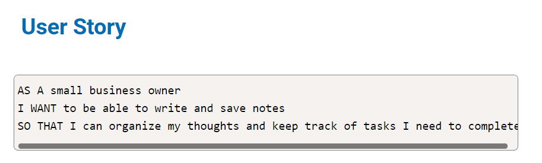
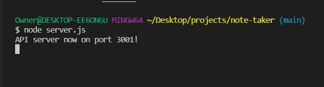
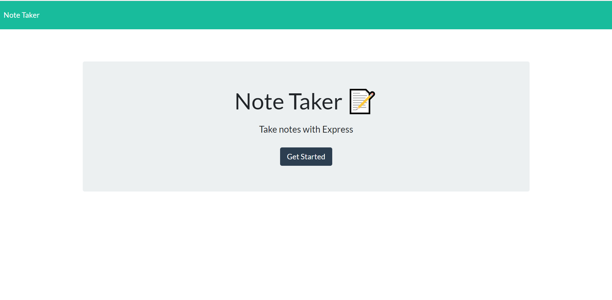
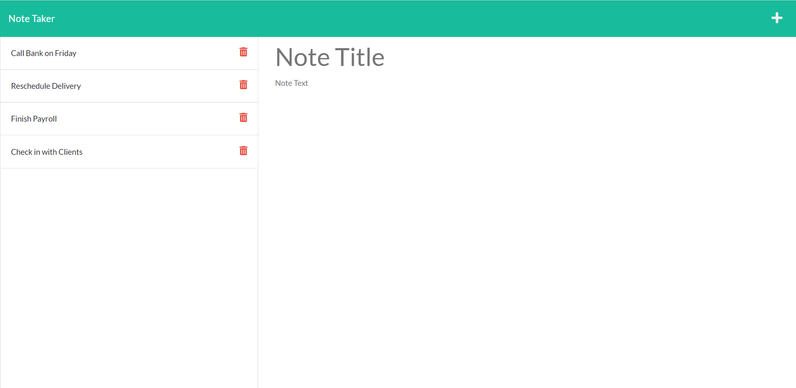
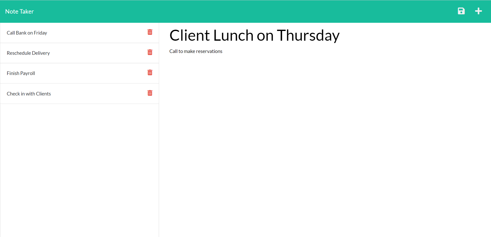
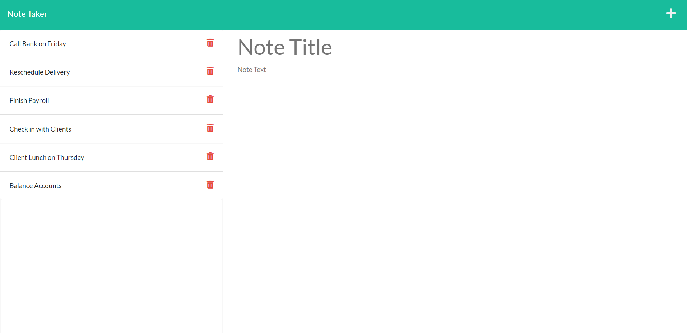
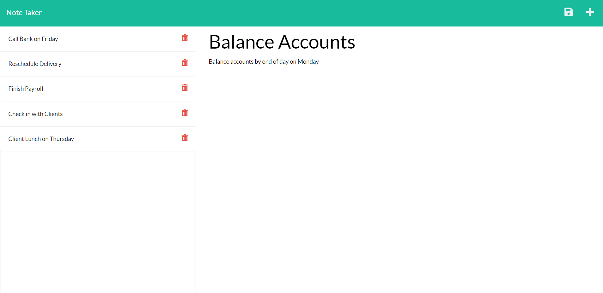
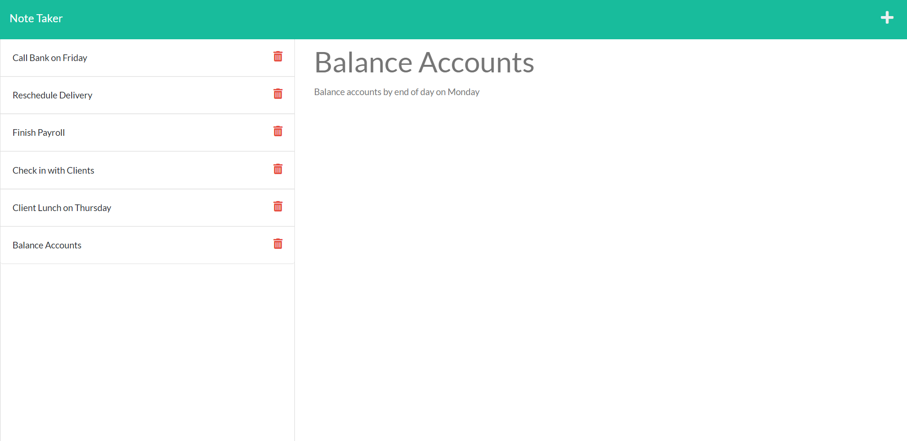
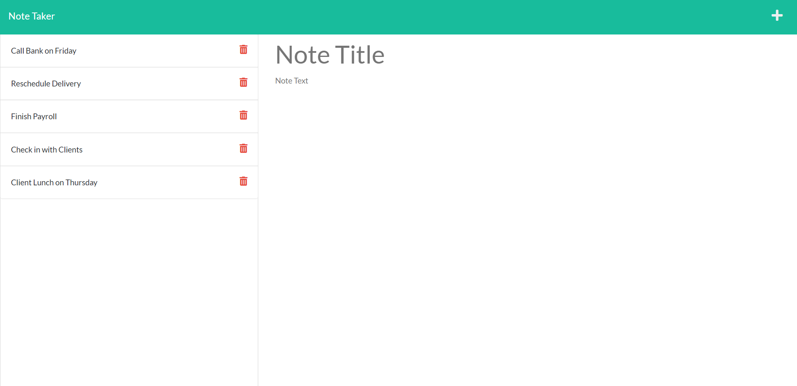

# Welcome to my NOTE TAKER app!

## Description

#### This NOTE TAKER app allows the user to quickly and easily write and save notes. This app utilizes HTML, CSS, JavaScript, Node.js, Express.js, JSON, Git, and Heroku.

## Table of Contents
* [Installation](#installation)
* [Usage](#usage)
* [License](#license)
* [Contributor](#contributor)
* [Demo](#demo)

## Installation
In order to run this Note Taker app, you will need to install node.js and express.js.

## Usage
To use this app, clone this repository and run server.js on the command-line to start. You will be greeted with a message indicating the API server is now available to view on port 3001.

Open your browser and type in localhost:3001 to view the home page of the Note Taker app.  

Click on the "Get Started" button to begin writing your notes. Once clicked, you will be directed to the notes page where you can view your saved notes on the left and enter a new note on the right. 

Click on the Note Title to enter your note's title and click on the Note Text to give your note some additional text.

Once your note is finished, click on the SAVE icon on the top right. When clicked, you will see your new note added to the saved list on the left.

You can add as many notes as you would like.

You can click on a saved note on the left to bring up on the right to edit.

You can click on a note on the left to delete at any time.

## License
The license for this project is the MIT.

Copyright © 2021

## Contributor
Jamie Williams

GitHub: [@jamwil1226](https://github.com/jamwil1226/)

## Addtional Contributors
Additional Contributors welcome! Reach out to me if you are interested!

## Demo
Watch this demo to see the Note Taker app in action!
https://www.loom.com/share/617f974aae4a423d8985e9aab2470b47

Note Taker App deployed to Heroku: https://frightening-wizard-96998.herokuapp.com/
## Questions
*If you have any questions, please reach out to me at* 

GitHub: [@jamwil1226](https://github.com/jamwil1226/)

Email: [jamwil1226@yahoo.com](mailto:jamwil1226@yahoo.com)

### I hope you enjoy using this Note Taker app! I welcome all contributions and feedback!

### I look forward to hearing from you!

### _Jamie Williams_ 

